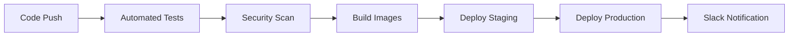

# 🚀 Orchestration Guide

Complete guide for deploying and managing the YouTube Comment Intelligence project with enterprise-grade orchestration.

## 📋 Overview

This project includes multiple orchestration options for different deployment scenarios:

- **🐳 Docker Compose** - Local development and testing
- **☸️ Kubernetes** - Production deployment and scaling
- **🔄 CI/CD Pipeline** - Automated deployment and testing
- **📊 Monitoring Stack** - Observability and alerting

## 🐳 Docker Compose Orchestration

### **Architecture Overview**

```
┌─────────────────┐    ┌─────────────────┐    ┌─────────────────┐
│   Nginx Proxy   │    │  Grafana Dash   │    │  Kibana Logs    │
│   (Load Bal.)   │    │   (Monitoring)  │    │  (Visualization)│
└─────────────────┘    └─────────────────┘    └─────────────────┘
         │                       │                       │
         ▼                       ▼                       ▼
┌─────────────────┐    ┌─────────────────┐    ┌─────────────────┐
│   Flask API     │    │   Prometheus    │    │  Elasticsearch  │
│   (Backend)     │    │   (Metrics)     │    │   (Log Store)   │
└─────────────────┘    └─────────────────┘    └─────────────────┘
         │                       │                       │
         ▼                       ▼                       ▼
┌─────────────────┐    ┌─────────────────┐    ┌─────────────────┐
│  Streamlit UI   │    │   PostgreSQL    │    │     Redis       │
│   (Frontend)    │    │   (Database)    │    │   (Cache)       │
└─────────────────┘    └─────────────────┘    └─────────────────┘
```

### **Services Included**

| Service | Purpose | Port | Health Check |
|---------|---------|------|--------------|
| **API** | Flask backend | 8080 | `/health` |
| **Web** | Streamlit UI | 8501 | `/` |
| **Redis** | Caching & sessions | 6379 | `redis-cli ping` |
| **PostgreSQL** | Data persistence | 5432 | `pg_isready` |
| **Nginx** | Reverse proxy | 80/443 | `/health` |
| **Prometheus** | Metrics collection | 9090 | `/` |
| **Grafana** | Monitoring dashboards | 3000 | `/` |
| **Elasticsearch** | Log aggregation | 9200 | `/` |
| **Kibana** | Log visualization | 5601 | `/` |
| **Filebeat** | Log shipping | - | - |
| **Celery Worker** | Background tasks | - | - |
| **Celery Beat** | Scheduled tasks | - | - |
| **Flower** | Celery monitoring | 5555 | `/` |

### **Quick Start**

```bash
# Start all services
docker-compose up -d

# View logs
docker-compose logs -f

# Stop all services
docker-compose down

# Rebuild and start
docker-compose up -d --build
```

### **Service Management**

```bash
# Start specific services
docker-compose up -d api web

# Scale services
docker-compose up -d --scale api=3 --scale web=2

# View service status
docker-compose ps

# View service logs
docker-compose logs api
docker-compose logs web

# Execute commands in containers
docker-compose exec api python -c "import app; print('API loaded')"
docker-compose exec web streamlit --version
```

### **Environment Configuration**

```bash
# Copy environment template
cp env_template.txt .env

# Edit environment variables
nano .env

# Generate secure keys
python generate_secrets.py
```

### **Health Checks**

```bash
# API Health
curl http://localhost:8080/health

# Web UI Health
curl http://localhost:8501

# Database Health
docker-compose exec postgres pg_isready -U youtube_user

# Redis Health
docker-compose exec redis redis-cli ping
```

## ☸️ Kubernetes Orchestration

### **Prerequisites**

```bash
# Install kubectl
curl -LO "https://dl.k8s.io/release/$(curl -L -s https://dl.k8s.io/release/stable.txt)/bin/linux/amd64/kubectl"

# Install minikube (for local development)
curl -LO https://storage.googleapis.com/minikube/releases/latest/minikube-linux-amd64
sudo install minikube-linux-amd64 /usr/local/bin/minikube

# Start minikube
minikube start
```

### **Deployment Structure**

```
k8s/
├── base/                    # Base configuration
│   ├── namespace.yaml       # Kubernetes namespace
│   ├── configmap.yaml       # Application configuration
│   ├── deployment.yaml      # API and Web deployments
│   └── service.yaml         # Network services
└── overlays/               # Environment-specific configs
    ├── dev/                # Development environment
    ├── staging/            # Staging environment
    └── prod/               # Production environment
```

### **Deploy to Kubernetes**

```bash
# Create namespace
kubectl apply -f k8s/base/namespace.yaml

# Apply base configuration
kubectl apply -f k8s/base/

# Check deployment status
kubectl get pods -n youtube-comment-intelligence

# View logs
kubectl logs -f deployment/youtube-comment-intelligence-api -n youtube-comment-intelligence

# Access services
kubectl port-forward service/youtube-comment-intelligence-api 8080:8080 -n youtube-comment-intelligence
kubectl port-forward service/youtube-comment-intelligence-web 8501:8501 -n youtube-comment-intelligence
```

### **Scaling and Management**

```bash
# Scale API replicas
kubectl scale deployment youtube-comment-intelligence-api --replicas=5 -n youtube-comment-intelligence

# Scale web replicas
kubectl scale deployment youtube-comment-intelligence-web --replicas=3 -n youtube-comment-intelligence

# Check resource usage
kubectl top pods -n youtube-comment-intelligence

# View service endpoints
kubectl get endpoints -n youtube-comment-intelligence
```

### **Environment-Specific Deployments**

```bash
# Development environment
kubectl apply -k k8s/overlays/dev/

# Staging environment
kubectl apply -k k8s/overlays/staging/

# Production environment
kubectl apply -k k8s/overlays/prod/
```

## 🔄 CI/CD Pipeline

### **GitHub Actions Workflow**

The CI/CD pipeline is defined in `.github/workflows/ci-cd.yml` and includes:

1. **Automated Testing** - Unit tests, integration tests
2. **Security Scanning** - Bandit, Safety checks
3. **Docker Image Building** - Multi-stage builds
4. **Container Registry** - GitHub Container Registry
5. **Staging Deployment** - Automated staging deployment
6. **Production Deployment** - Blue-green deployment
7. **Slack Notifications** - Deployment status alerts

### **Pipeline Stages**



### **Triggering Deployments**

```bash
# Push to main branch (triggers full pipeline)
git push origin main

# Push to develop branch (triggers testing only)
git push origin develop

# Create pull request (triggers testing and security scan)
git checkout -b feature/new-feature
git push origin feature/new-feature
# Create PR on GitHub
```

### **Pipeline Configuration**

The pipeline uses the following secrets (configure in GitHub):

- `KUBE_CONFIG_STAGING` - Kubernetes config for staging
- `KUBE_CONFIG_PRODUCTION` - Kubernetes config for production
- `SLACK_WEBHOOK` - Slack webhook for notifications

## 📊 Monitoring & Observability

### **Prometheus Metrics**

**Application Metrics:**
- Request rate and response time
- Error rate and status codes
- Prediction accuracy and confidence
- Model loading time

**System Metrics:**
- CPU and memory usage
- Disk I/O and network traffic
- Container resource utilization

### **Grafana Dashboards**

**Application Dashboard:**
- Real-time request rate
- Response time percentiles
- Error rate trends
- Prediction accuracy

**System Dashboard:**
- CPU and memory usage
- Network traffic
- Disk I/O
- Container health

### **ELK Stack Logs**

**Application Logs:**
- API request/response logs
- Error logs and stack traces
- Security event logs
- Performance metrics

**System Logs:**
- Container logs
- Infrastructure events
- Health check results

### **Log Aggregation**

```bash
# View application logs
docker-compose logs -f api

# View system logs
docker-compose logs -f elasticsearch kibana

# Access Kibana
open http://localhost:5601

# Access Grafana
open http://localhost:3000
```

## 🔒 Security & Performance

### **Nginx Configuration**

**Security Features:**
- Rate limiting (10 req/s for API, 30 req/s for web)
- Security headers (X-Frame-Options, X-XSS-Protection)
- SSL/TLS encryption (configured but commented)
- Request size limits

**Performance Features:**
- Gzip compression
- Static file caching
- Load balancing
- Connection pooling

### **Kubernetes Security**

**Network Policies:**
- Pod-to-pod communication control
- Ingress/egress traffic filtering
- Service mesh ready

**Secrets Management:**
- Kubernetes secrets for sensitive data
- Encrypted at rest
- RBAC for access control

### **Monitoring Security**

**Access Control:**
- Grafana authentication
- Prometheus basic auth
- Kibana security settings
- Audit logging

## 🛠️ Troubleshooting

### **Common Issues**

#### Docker Compose Issues

**Service won't start:**
```bash
# Check logs
docker-compose logs service-name

# Rebuild image
docker-compose build service-name

# Restart service
docker-compose restart service-name
```

**Port conflicts:**
```bash
# Check port usage
lsof -i :8080

# Kill process using port
sudo kill -9 $(lsof -t -i:8080)
```

#### Kubernetes Issues

**Pod not starting:**
```bash
# Check pod status
kubectl describe pod pod-name -n youtube-comment-intelligence

# Check logs
kubectl logs pod-name -n youtube-comment-intelligence

# Check events
kubectl get events -n youtube-comment-intelligence
```

**Service not accessible:**
```bash
# Check service endpoints
kubectl get endpoints -n youtube-comment-intelligence

# Check service configuration
kubectl describe service service-name -n youtube-comment-intelligence
```

#### Monitoring Issues

**Prometheus not scraping:**
```bash
# Check targets
curl http://localhost:9090/api/v1/targets

# Check configuration
docker-compose exec prometheus cat /etc/prometheus/prometheus.yml
```

**Grafana not loading:**
```bash
# Check Grafana logs
docker-compose logs grafana

# Reset admin password
docker-compose exec grafana grafana-cli admin reset-admin-password admin
```

### **Performance Optimization**

**Docker Compose:**
```bash
# Use resource limits
docker-compose up -d --scale api=3 --scale web=2

# Monitor resource usage
docker stats

# Optimize images
docker-compose build --no-cache
```

**Kubernetes:**
```bash
# Set resource requests/limits
kubectl patch deployment youtube-comment-intelligence-api \
  -p '{"spec":{"template":{"spec":{"containers":[{"name":"api","resources":{"requests":{"memory":"512Mi","cpu":"250m"},"limits":{"memory":"1Gi","cpu":"500m"}}}]}}}}'

# Enable horizontal pod autoscaling
kubectl autoscale deployment youtube-comment-intelligence-api \
  --cpu-percent=70 --min=2 --max=10 -n youtube-comment-intelligence
```

## 📈 Scaling Strategies

### **Horizontal Scaling**

**Docker Compose:**
```bash
# Scale API instances
docker-compose up -d --scale api=5

# Scale web instances
docker-compose up -d --scale web=3
```

**Kubernetes:**
```bash
# Scale deployments
kubectl scale deployment youtube-comment-intelligence-api --replicas=5 -n youtube-comment-intelligence

# Auto-scaling
kubectl autoscale deployment youtube-comment-intelligence-api \
  --cpu-percent=70 --min=2 --max=10 -n youtube-comment-intelligence
```

### **Vertical Scaling**

**Resource Limits:**
```yaml
resources:
  requests:
    memory: "512Mi"
    cpu: "250m"
  limits:
    memory: "1Gi"
    cpu: "500m"
```

### **Database Scaling**

**PostgreSQL:**
- Connection pooling
- Read replicas
- Partitioning for large datasets

**Redis:**
- Redis Cluster for high availability
- Redis Sentinel for failover
- Redis persistence for data durability

## 🔄 Backup & Recovery

### **Data Backup**

**PostgreSQL:**
```bash
# Create backup
docker-compose exec postgres pg_dump -U youtube_user youtube_intelligence > backup.sql

# Restore backup
docker-compose exec -T postgres psql -U youtube_user youtube_intelligence < backup.sql
```

**Redis:**
```bash
# Create backup
docker-compose exec redis redis-cli BGSAVE

# Copy backup file
docker cp youtube-comment-intelligence-redis:/data/dump.rdb ./redis-backup.rdb
```

### **Configuration Backup**

```bash
# Backup Kubernetes resources
kubectl get all -n youtube-comment-intelligence -o yaml > k8s-backup.yaml

# Restore from backup
kubectl apply -f k8s-backup.yaml
```

## 📚 Additional Resources

- **Docker Documentation**: https://docs.docker.com/
- **Kubernetes Documentation**: https://kubernetes.io/docs/
- **Prometheus Documentation**: https://prometheus.io/docs/
- **Grafana Documentation**: https://grafana.com/docs/
- **ELK Stack Documentation**: https://www.elastic.co/guide/

---

**🎉 Your YouTube Comment Intelligence project is now fully orchestrated with enterprise-grade deployment, monitoring, and scaling capabilities!** 